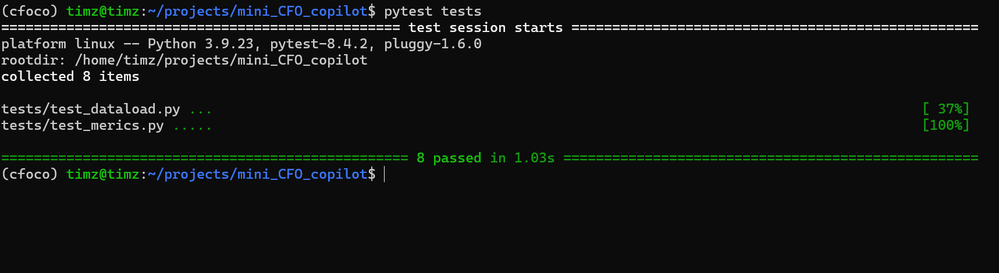

# Mini_CFO_Copilot
A LLM powered agent for CFO Copilot, it can calculate:  
- Revenue (USD): actual vs budget.
- Gross Margin %: (Revenue – COGS) / Revenue.
- Opex total (USD): grouped by Opex:* categories.
- EBITDA (proxy): Revenue – COGS – Opex.
- Cash runway: cash ÷ avg monthly net burn (last 3 months).

## How to Run:
### Clone this repo
```
git clone https://github.com/cyzhang39/mini_CFO_copilot.git
```
### Put a data.xlsx into fixtures, which should contain:
actuals.csv: month, entity, account_category, amount, currency  
budget.csv: month, entity, account_category, amount, currency  
cash.csv: month, entity, cash_usd  
fx.csv: month, currency, rate_to_usd  
### Create a .env file at root
```
USE_LLM=true
HF_API_URL=...
HF_TOKEN=...
HF_MODEL=...
```
### Using conda and install requirements
```
conda create -n cfopilot python=3.9 --y
conda activate cfopilot
pip install -r requirements.txt
```
### Tests (load data and data functions)
```
pytest tests
```

### Start streamlit
```
streamlit run app.py
```

## Video Demo
<video width="640" height="480" controls>
  <source src="tests/demo.mp4" type="video/mp4">
</video>